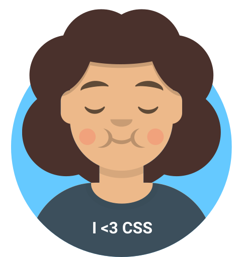
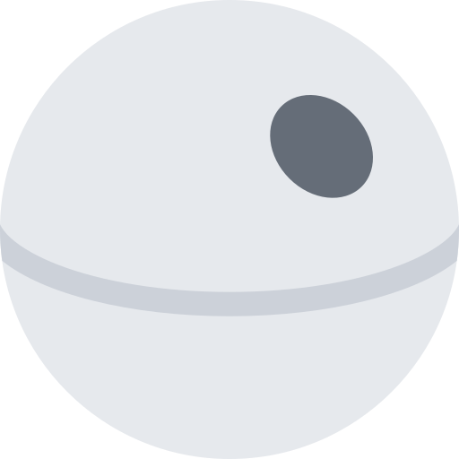

<!--
  A curiosidade matou o gato...
    brincadeirinha, pode ficar à
      vontade. Seja bem-vindo(a),
        caro(a) detetive
-->

<h2>
  
</h2>



Ooh, puxa! :( Você deve estar exausto(a) de tanto stalkear perfis aqui no GitHub... por favor, aceite esse cappuccino como uma recompensa por ter chegado até aqui. &nbsp;&nbsp; Seja muitíssimo bem-vindo(a) ao meu cafofo. Permita que eu me apresente:

```javascript
const matheus = {
  pronomes: 'ele/dele',
  skills: {
    backend: ['node', 'express'],
    frontend: {
      web: ['react', 'material-ui'],
      desktop: ['electron'],
      mobile: ['pwa', 'react native', 'expo', 'react native paper']
    },
    dbs: ['mongo', 'mysql', 'postgres'],
    misc: ['figma', 'firebase', 'heroku', 'python', 'php', 'java']
  }
};
```

### Minha autobiografia &nbsp;

Atualmente, estou desenvolvendo apps para aprimorar as minhas técnicas de desenvolvimento de _software_. Logo pretendo iniciar meus estudos com TypeScript e, eventualmente, desbravar o campo da Inteligência Artificial. Aceito quaisquer propostas de projeto no momento, desde que exijam as _skills_ supracitadas.

Tenho pouca experiência para coletar requisitos de _stakeholders_ em uma entrevista a fim de documentá-los e definir o escopo do projeto. Meus pontos fracos são manutenir códigos-fonte ilegíveis (que tenham sido escritos por outros desenvolvedores) e entregar _backlogs_ em intervalos curtíssimos de tempo, pois infelizmente não é minha especialidade me concentrar sob muita pressão. Acredite: eu já tentei. Por último e não menos importante: em nenhuma hipótese escrevo uma linha de código sequer sem antes ter tomado uma boa xícara de café pelando e sem muito açúcar (isso não é uma exigência para vagas presenciais).

Sou autodidata, caprichoso e perfeccionista. Embora eu ainda esteja aprendendo sobre UI/UX Design e responsividade, os protótipos visuais de alguns apps que desenhei foram aplaudidos pelos clientes e desenvolvedores com quem já trabalhei, bem como as respectivas telas estáticas. Tenho facilidade para trabalhar em equipe, especialmente quando cada desenvolvedor tem seu próprio papel. Evito ao máximo fazer gambiar-- digo, adequações técnicas, para não comprometer a legibilidade dos códigos. Afinal, escrever código é uma forma de arte.

Para propostas, convites, dúvidas ou pedidos de socorro, deixo aqui os meus meios de contato.

<div style="flex-direction: row; align-items: center; display: flex;">
  <a target="_blank" href="https://bitbucket.org/mdccg">
    
  </a>
  
  <a target="_blank" href="https://www.linkedin.com/in/matheus-comparotto-1a7895113">
    
  </a>
  
  <a target="_blank" href="https://youtu.be/n605S06Cx-A">
    
  </a>
  
  <a href="mailto:comparotto.js@gmail.com">
    
  </a>
</div>

No momento, estou propenso a aceitar apenas cartas de Hogwarts-- brincadeiras à parte. Não tenha receio de me escrever, respondo quaisquer e-mails pelo endereço eletrônico acima.

<details>
  <summary>Créditos pelas mídias utilizadas</summary>
  
  - [Avataaars — Avatar Illustrations Sketch Library](https://avataaars.com/)
  - [Coffee Cup Vector SVG Icon (246) - SVG Repo](https://www.svgrepo.com/svg/186270/coffee-cup)
  - [Death Star Star Wars Vector SVG Icon - SVG Repo](https://www.svgrepo.com/svg/275952/death-star-star-wars)
  - [alexandresanlim/Badges4-README.md-Profile: 👩‍💻👨‍💻 Improve your README.md profile with these amazing badges.](https://github.com/alexandresanlim/Badges4-README.md-Profile)
</details>
