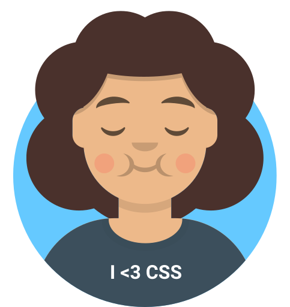

<!-- Por favor, não desista de me contratar por causa da indentação desse README, ele funciona assim mesmo -->

<div style="float: right; display: flex;">
  <a href="./README.md">
    
  </a>

  <a href="#" style="margin-left: 16px;">
    
  </a>
</div>

<br />
<br />

# Saudações! 



Oh, Deus! :( Você deve estar exausto de tanto stalkear perfis aqui no GitHub&hellip; por favor aceite este _cappuccino_ como uma recompensa por ter chegado até aqui.

Bem-vindo ao meu perfil, permita-me me apresentar:

```javascript
export const skills = {
  favoriteLanguage: 'TypeScript',
  frontEnd: {
    web: ['React', 'Vue (learning...)'],
    android: 'React Native',
  },
  backEnd: ['Express', 'Node'],
  databases: ['MongoDB', 'PostgreSQL', 'MySQL'],
  tddTools: ['Cypress', 'Jest', 'Jasmine'],
  others: ['CI/CD', 'TypeORM', 'Vercel', 'Firebase', 'Figma'],
};
```

## Estatísticas do perfil


<details>
  <summary>
  
  ## Experiência e projetos relevantes
  </summary>

  

  Eu sou [técnico em Informática](https://www.ifms.edu.br/campi/campus-aquidauana/cursos/integrado/informatica) (2017-2020) e futuro [tecnólogo em Sistemas para Internet](https://www.ifms.edu.br/campi/campus-aquidauana/cursos/graduacao/sistemas-para-internet/sistemas-para-internet) (2021-2024) pelo [Instituto Federal de Educação, Ciência e Tecnologia de Mato Grosso do Sul](https://ifms.edu.br) câmpus Aquidauana.

  

  Desde 2018, tenho sido bolsista através do Programa de Bolsas de Iniciação Científica Institucional. Além dos projetos de software desenvolvidos durante ambos os cursos, participei ativamente em projetos de ensino voltados para o desenvolvimento de software, entre os quais posso mencionar:

  - ### [Kalivôno: promovendo o acesso à língua Terena por meio de um app progressivo](https://kalivono-app.web.app) (2019-2020, 2023);
    Este aplicativo consiste em um dicionário para revitalizar a língua Terena, ou seja, uma língua indígena, e fornecer meios fáceis e modernos para sua difusão.

  - ### Desenvolvimento de um aplicativo para acompanhamento dos egressos do IFMS (2021-2022).
    Este aplicativo é uma rede social empresarial para os graduados do Instituto Federal de Mato Grosso do Sul. Seu objetivo é coletar avaliações de cursos, fornecer oportunidades de emprego e incentivá-los a continuar na instituição através de outros cursos ou processos de seleção, para que possam se tornar funcionários da instituição.

  - ### IFMS Aqui Comunica: Scrum (2018);
    Este projeto teve como foco o desenvolvimento de um site de eventos para a instituição usando a metodologia Scrum. Ele recebeu credenciamento para a Feira de Tecnologia, Engenharia e Ciências de Mato Grosso do Sul (conhecida pela sigla FETECMS), considerada o maior evento científico na região Centro-Oeste do Brasil.

  Além disso, estou focado em manter meus repositórios detalhados para demonstrar claramente as atividades realizadas durante minhas aulas, bem como o que aprendi e como isso pode contribuir para aqueles que  desejam explorar minhas habilidades.
</details>

Para propostas, convites, dúvidas ou sinais de aflição, deixo aqui meus meios de contato:

<p>
  <a target="_blank" href="mailto:comparotto.js@gmail.com">
    
  </a>

  <a target="_blank" href="https://www.linkedin.com/in/matheus-comparotto-1a7895113">
    
  </a>

  <a target="_blank" href="https://bitbucket.org/mdccg">
    
  </a>

  <a target="_blank" href="https://t.me/mdccg">
    
  </a>

  <a target="_blank" href="https://wa.me/+5567992224129">
    
  </a>

  <a target="_blank" href="https://discord.com/channels/@me/mdccg/">
    
  </a>

  <!--
  <a target="_blank" href="https://www.reddit.com/user/mdccg">
    
  </a>
  -->
</p>

Nota: Eu ficaria **muito** grato se recebesse uma carta de Hogwarts. É isso, pessoal!